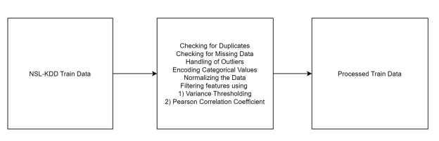
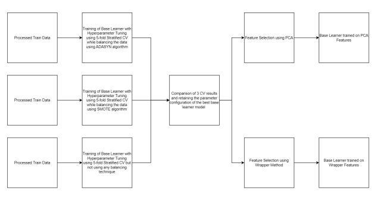
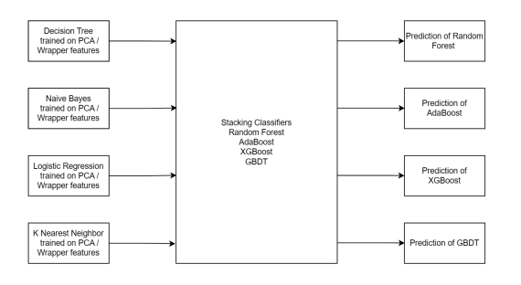

# DNS Exfiltration Detection
In this project, NSL-KDD dataset is used for the task of Intrusion and DNS exfiltration detection. This project uses a unique methodology to produce good results that is robust and identifies the intrusion without any issues.
More details about the project is describved in this document.
For preprocessing the data the following steps are implemented.



Here is the architecture of the project.





## Requirements

To run this project, you will need:

- Python 3
- PyTorch
- Scikit-learn
- Pandas

You can install the required dependencies by running:

```bash
pip install scikit-learn pandas
```

## Getting Started

Run the notebooks in this order

Make sure you have KDDTest+ and KDDTrain+ txt files all other csv files would be generated by running the notebooks sequentially

1) Exploratory Data Analysis v2.ipynb

2) The ones below can be run in parallel
Decision Tree v2.ipynb
Naive Bayes v2.ipynb
KNN v2.ipynb
Logistic Regression.ipynb
Base Learners ADASYN, SMOTE - CV Scores; PCA Variances Calculated.ipynb

3) The ones below can be run in parallel
Stacking Classifiers - PCA based Features.ipynb
Stacking Classifiers - PCA based Features - 5 Fold CV.ipynb
Stacking Classifiers - Wrapper based Features.ipynb
Stacking Classifiers - Wrapper based Features - 5 Fold CV.ipynb

Note - 3 should be executed after 2 completes and 2 should be executed after 1 completes.
However, in 2 and 3 the multiple ipynbs can be run in parallel